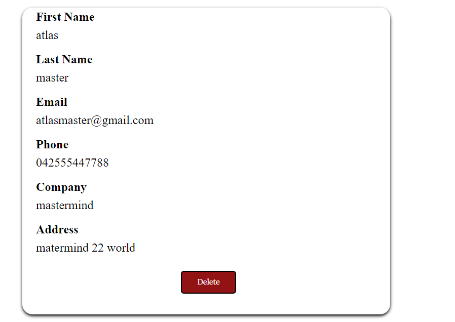

# Goals of this project

* this project is a form automatically creating cards containing the history of the various submissions these cards can be erased. the form is also synchronized between the different browser tabs.

# How to use the code

* you just have to open the index.html file with a browser.
# Demo
* follow this link for see the demo of my page 😊 https://3npc0nf1g.github.io/MagicForm/submit__history.html

# ReadMe to complete ...
